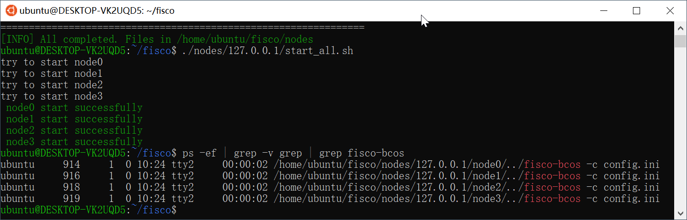

文/金九链 

今天讲一下如何在2分钟启动一个FISCO BCOS区块链。

首先安装必要工具
```
sudo apt install -y openssl curl
```

然后创建并进入目录

```
cd ~ && mkdir -p fisco && cd fisco
```

下载安装脚本
```
curl -LO https://github.com/FISCO-BCOS/FISCO-BCOS/releases/download/`curl -s https://api.github.com/repos/FISCO-BCOS/FISCO-BCOS/releases | grep "\"v2\.[0-9]\.[0-9]\"" | sort -u | tail -n 1 | cut -d \" -f 4`/build_chain.sh && chmod u+x build_chain.sh
```

配置4个节点
```
./build_chain.sh -l "127.0.0.1:4" -p 30300,20200,8545
```


启动4个节点

```
./nodes/127.0.0.1/start_all.sh
```


检查进程

```
ps -ef | grep -v grep | grep fisco-bcos
```



查看node0节点的连接数
```
tail -f nodes/127.0.0.1/node0/log/log*  | grep connected
```


查看共识情况

```
tail -f nodes/127.0.0.1/node0/log/log*  | grep +++
```

如果不断输出包含“++++Generating seal”字符串的输出，则说明共识正常。


体验结束，FISCO BCOS区块链已经从无到有在你的电脑上面工作了。

如果你对 FISCO BCOS 感兴趣，欢迎加我微信 jin-jiu-lian
